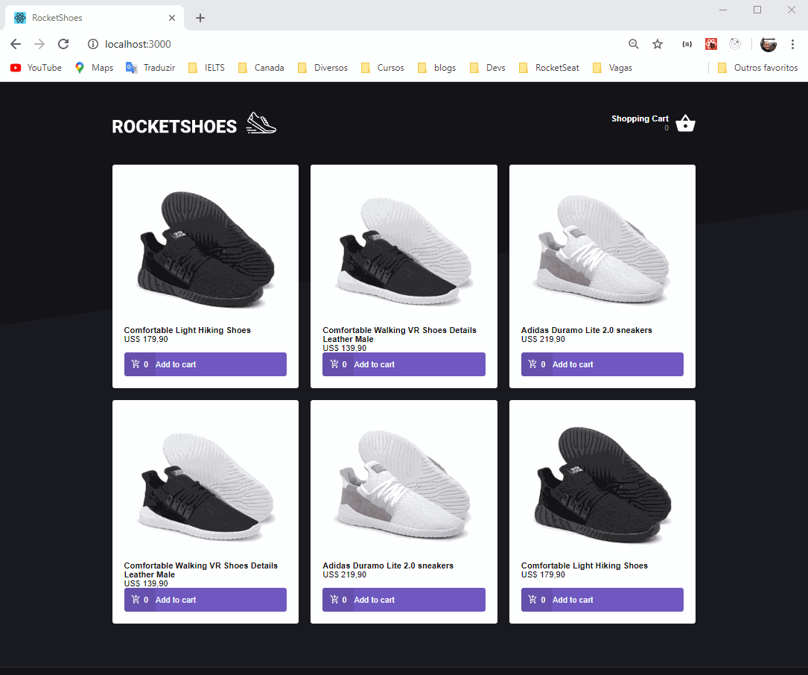

<h1 align="center">
  
</h1>

<h3 align="center">RocketShoes Store</h3>

---

<p align="center"> This project is about a shoes store.
    <br> 
</p>

## 📝 Table of Contents

- [About](#about)
- [Demo](#demo)
- [Getting Started](#getting_started)
- [Deployment](#deployment)
- [Usage](#usage)
- [Built Using](#built_using)
- [Authors](#authors)
- [Acknowledgments](#acknowledgement)

## 🧐 About <a name = "about"></a>

This is a study case project.

## Demo



## 🏁 Getting Started <a name = "getting_started"></a>

These instructions will get you a copy of the project up and running on your local machine for development and testing purposes. See [deployment](#deployment) for notes on how to deploy the project on a live system.

### Prerequisites

What things you need to install the software and how to install them.

```
Give examples
```

### Installing

A step by step series of examples that tell you how to get a development env running.

Say what the step will be

```
Give the example
```

And repeat

```
until finished
```

End with an example of getting some data out of the system or using it for a little demo.

## 🔧 Running the tests <a name = "tests"></a>

Explain how to run the automated tests for this system.

### Break down into end to end tests

Explain what these tests test and why

```
Give an example
```

### And coding style tests

Explain what these tests test and why

```
Give an example
```

## 🎈 Usage <a name="usage"></a>

Add notes about how to use the system.

## 🚀 Deployment <a name = "deployment"></a>

Add additional notes about how to deploy this on a live system.

## ⛏️ Built Using <a name = "built_using"></a>

axios

- [axios](https://github.com/axios/axios) - axios
- [immer](https://github.com/immerjs/immer) - immer
- [polished](https://github.com/styled-components/polished) - polished
- [react](https://github.com/facebook/react) - react
- [react-icons](https://github.com/react-icons/react-icons) - react-icons
- [react-toastify](https://github.com/fkhadra/react-toastify) - react-toastify
- [reactotron-react-js](https://github.com/infinitered/reactotron) - reactotron-react-js
- [styled-components](https://github.com/styled-components/styled-components) - styled-components
- [redux](https://github.com/reduxjs/redux) - redux
- [react-redux](https://github.com/reduxjs/react-redux) - react-redux
- [redux-saga](https://github.com/redux-saga/redux-saga) - redux-saga
- [prettier](https://github.com/prettier/prettier) - Prettier
- [eslint](https://github.com/eslint/eslint/) - eslint
- [eslint-config-prettier](https://github.com/prettier/eslint-config-prettier) - eslint Config Prettier
- [eslint-plugin-import](https://github.com/benmosher/eslint-plugin-import) - eslint plugin import
- [eslint-plugin-prettier](https://github.com/prettier/eslint-plugin-prettier) - eslint plugin prettier
- [eslint-config-airbnb-base](https://github.com/airbnb/javascript/tree/master/packageseslint-config-airbnb-base) - packageseslint-config-airbnb-base

## ✍️ Authors <a name = "authors"></a>

- [@arllain](https://github.com/arllain)
